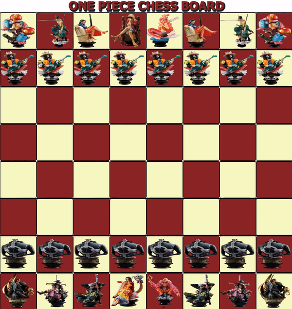

<body>
	<h1>ONE PIECE CHESS BOARD</h1>
	
This project is a simple front-end Chessboard with implemented One Piece chesspieces built using Javascript, HTML, and CSS. Players can move their pieces using drag-and-drop functionality. The game should have the standard starting positions for the pieces. The game look visually appealing with CSS styling.
	
</body>